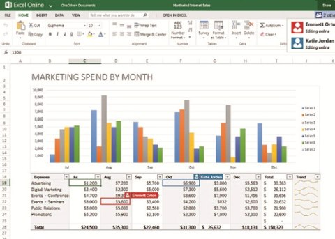
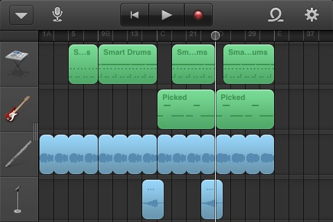
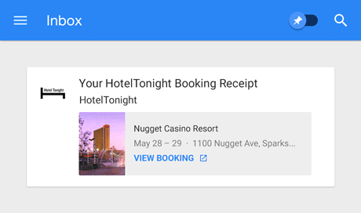
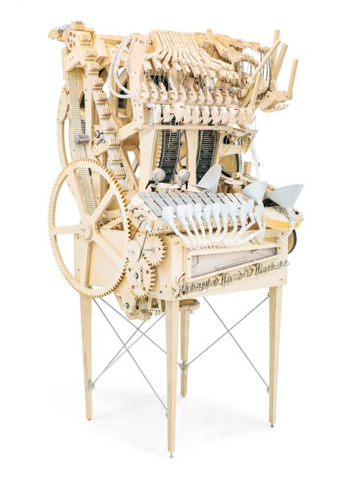
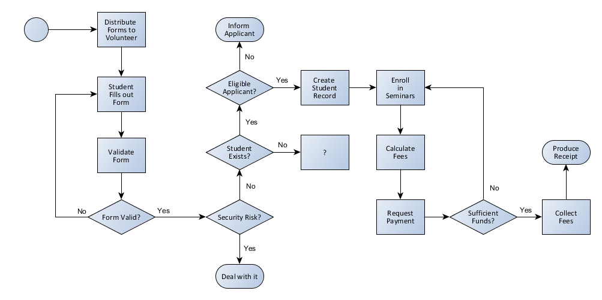

# The Specification Process
## *Why*, *Who*, *What*, *How*

By Jon Wilson

### Software is Magic Machinery
When software is done well, it appears to be magic.  A really well-designed application can capture the *essence* of a workflow in its distilled form, wasting very little of the user's mental energy.  It anticipates a user's needs.  Its core mission is clear.  It makes a user's path to success intuitive and discoverable.  It makes a task easier.

Example: Microsoft Excel

Example: Garageband for the iPhone

Example: Google Inbox

#### The Machinery
Despite its ethereal nature, software is not actually magic; it is built atop a physical machine.  It isn't some spell cast by a wizard/witch; it is a sequence of instructions issued to that physical machine, painstakingly composed by we programmers.  We put a lot of thought and effort into it.

[Marble Machine](https://www.youtube.com/watch?v=IvUU8joBb1Q)

Common duties performed by software machinery:
- sending/receiving data over a network
- loading data from a database / saving data to a database
- displaying graphical widgets on a screen for a user to interact with
- executing logic, number-crunching, validation

### To build, one first must plan
Software takes time to build.  To keep us on track, we have to have a plan.

A specification communicates our current understanding of where the machinery and user meet.
It communicates clear goals and purpose.
It tells our clients what we understand about their problem space and what solution we plan to build for them.
It reminds the developers what they need to build.
It gives everyone the language they need to discuss the software being built.
With a clear specificiation, everyone can be on the same page.

**IMPORTANT CAVEAT:** We shall not plan everything *up front*.  At the start, it is impossible to know exactly in which direction the project will develop.  Especially when breaking new ground, we will all be learning as we go.  We must strive to plan and build iteratively, creating the opportunity for feedback to influence our plan.

### Explain *Why*
Certainly there's a reason for the project, right?  Lead with that.  What is the problem that our software will solve?  What is its reason for existing? If you had 30 seconds to sell someone on your software, what would you say?

### Explain *Who* and *What*
You should strongly consider transcribing any terms (with their definitions) that strike you as particularly important in describing the domain.  In particular, if a common word is used in a not-so-common way, it should probably be explicitly defined in your specification.  In the parlance of [*Domain Driven Design*](https://en.wikipedia.org/wiki/Domain-driven_design), this set of terms is known as the [*Ubiquitous Language*](https://www.agilealliance.org/glossary/ubiquitous-language/).

Capture short, simple descriptions of features told from the user's perspective (a.k.a. *User Stories*).  Use the *Ubiquitous Language* in these descriptions. Use one of the following formats:
- "As a [role], I want [goal/desire]"
- "As a [role], I want [goal/desire] so that [benefit]"
- "In order to [receive benefit] as a [role], I want [goal/desire]"
- "As [who] [when] [where], I [what] because [why]."
- "As a [role], I can [action with system] so that [external benefit]"
- "As [persona], I want [what?] so that [why?]"

Use a flowchart to describe a process or user story that has logical branching, multiple steps, and/or involves multiple parties. The [yEd Graph Editor](http://www.yworks.com) is quite capable.

### Explain *How*
After you've established the *Why*, *Who*, and *What* of the domain, it might be good to nail down some specifics of the *How*.

If you provide mockups (a.k.a. wireframes), take care to keep them as simple as possible.  Sometimes, a lot of detail can be distracting and communicate the wrong thing.  Focus on the key design considerations and leave the incidental stuff for later. Try [Pencil](http://pencil.evolus.vn/) (FREE) or [Balsamiq](http://www.balsamiq.com) (NOT FREE).

### A Specification is to Code as Peanut Butter is to Jelly
Specifications get checked-in to the version control system, in the same repository as the project.  This gives us several advantages:
- Consolidated, easy to find.
- Spec and code stay in sync
    1. Changes to the spec are done on a new branch, at the start of a Sprint.
    2. Related changes to the code are then made in the same branch.
- History is preserved, so edits can be sweeping